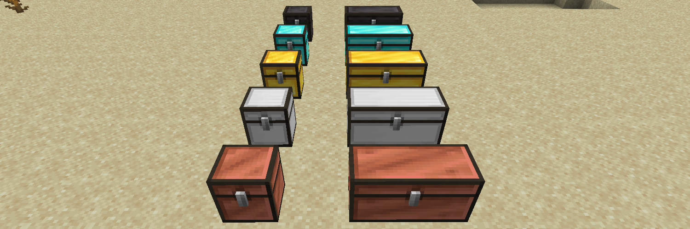
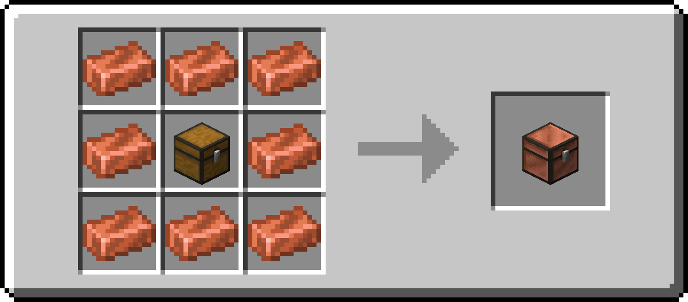
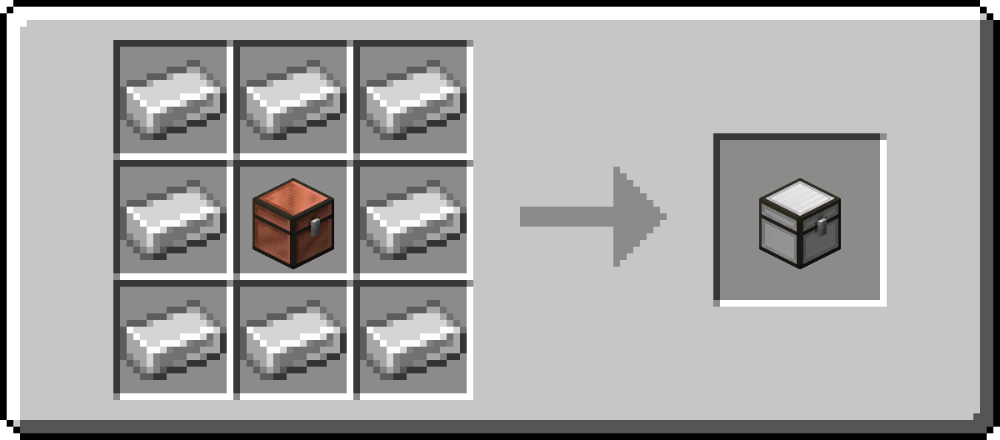
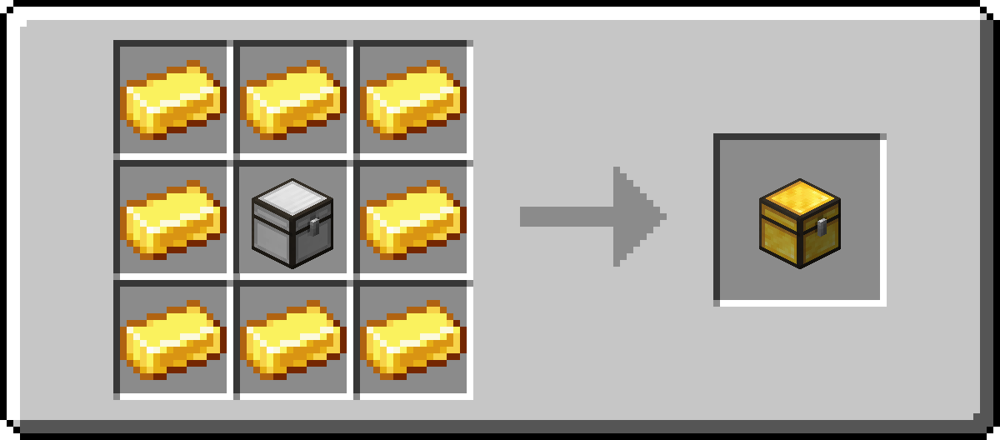
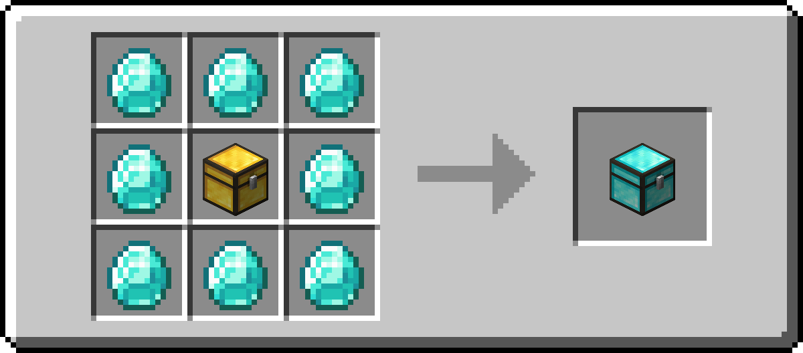
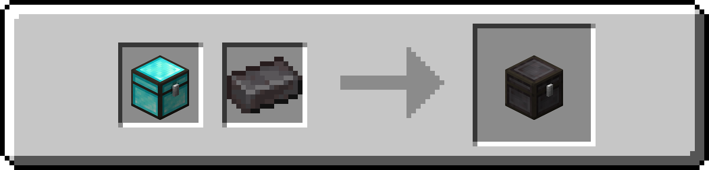
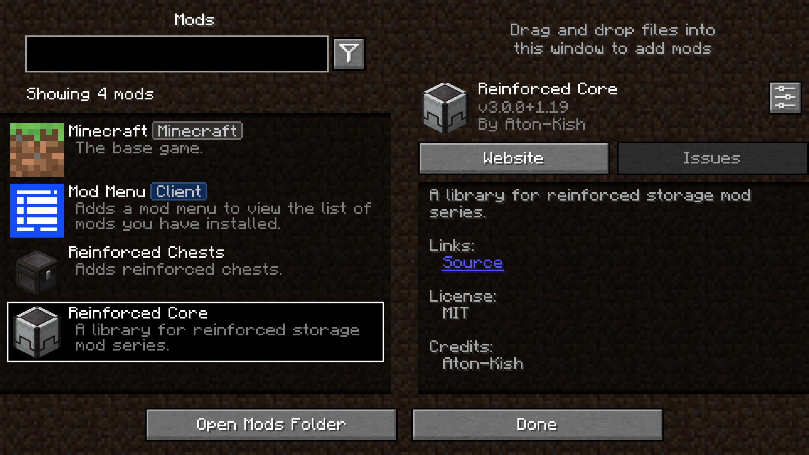
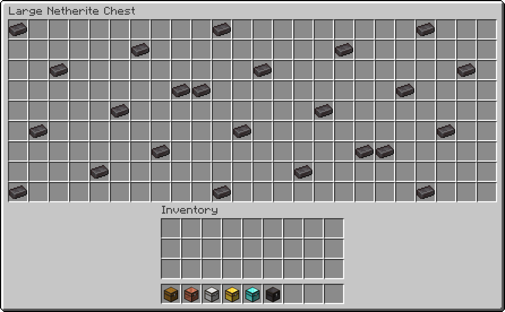
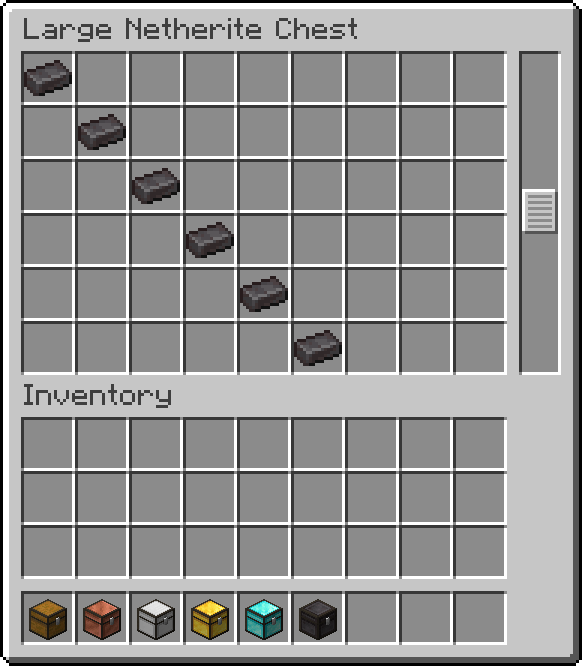
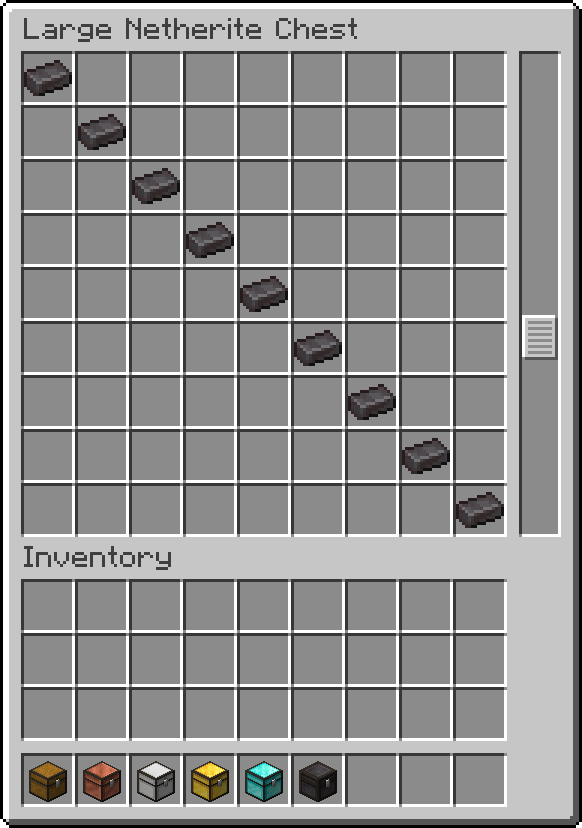

# Reinforced Chests

The Reinforced Chests mod adds reinforced chests.

## Reinforced Storage Mod Series

- [Reinforced Shulker Boxes](https://github.com/Aton-Kish/reinforced-shulker-boxes)
- [Reinforced Barrels](https://github.com/Aton-Kish/reinforced-barrels)

## Recipe

| Name            | Type            | Ingredients                     | Recipe                                                                                               | Description                                                                                                                                                     |
| --------------- | --------------- | ------------------------------- | ---------------------------------------------------------------------------------------------------- | --------------------------------------------------------------------------------------------------------------------------------------------------------------- |
| Copper Chest    | Shaped Crafting | Chest + Copper Ingot            |                 | A copper chest has 45 slots of inventory space, and a large copper chest has twice that amount, at 90 slots.                                                    |
| Iron Chest      | Shaped Crafting | Copper Chest + Iron Ingot       |                     | An iron chest has 54 slots of inventory space, and a large iron chest has twice that amount, at 108 slots.                                                      |
| Gold Chest      | Shaped Crafting | Iron Chest + Gold Ingot         |                     | A gold chest has 81 slots of inventory space, and a large gold chest has twice that amount, at 162 slots.                                                       |
| Diamond Chest   | Shaped Crafting | Gold Chest + Diamond            |               | A diamond chest has 108 slots of inventory space, and a large diamond chest has twice that amount, at 216 slots.                                                |
| Netherite Chest | Smithing        | Diamond Chest + Netherite Ingot |  | A netherite chest has 108 slots of inventory space, and a large netherite chest has twice that amount, at 216 slots. This is resistant to blast, fire and lava. |

## Configure

[The Reinforced Core lib](https://github.com/Aton-Kish/reinforced-core) has been integrated with [Mod Menu](https://www.curseforge.com/minecraft/mc-mods/modmenu) since version 3.0.0.

### Screen Type

_Available in Reinforced Chests mod version 2.1.0+._

Screen type is `SINGLE` or `SCROLL`. (default: `SINGLE`)

| `SINGLE` screen                               | `SCROLL` screen                                |
| --------------------------------------------- | ---------------------------------------------- |
|  |  |

### Scroll Screen

#### Rows

_Available in Reinforced Chests mod version 2.1.0+._

Rows is an integer in the range from `6` to `9`. (default: `6`)

| Rows: `6`                                              | Rows: `9`                                              |
| ------------------------------------------------------ | ------------------------------------------------------ |
|  |  |

## License

The Reinforced Chests mod is licensed under the MIT License, see [LICENSE](./LICENSE).
